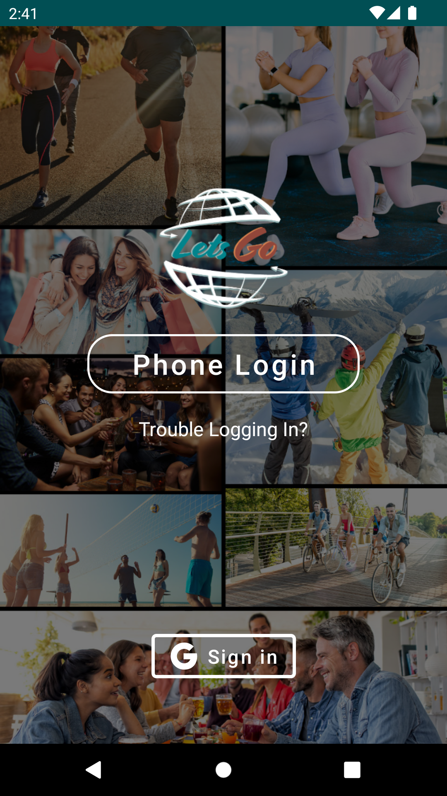
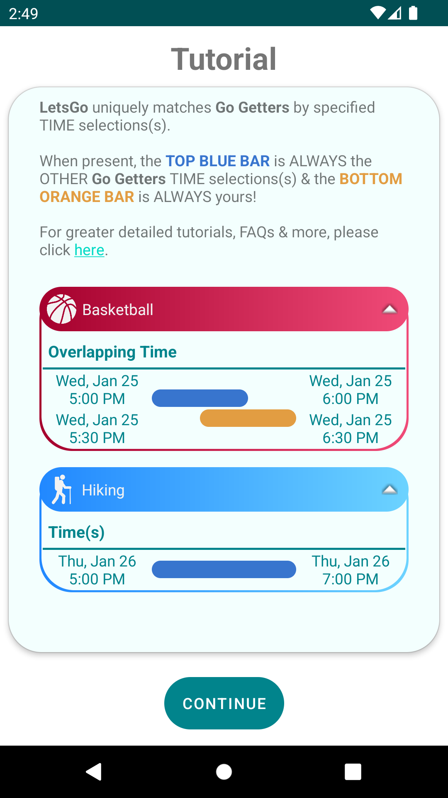
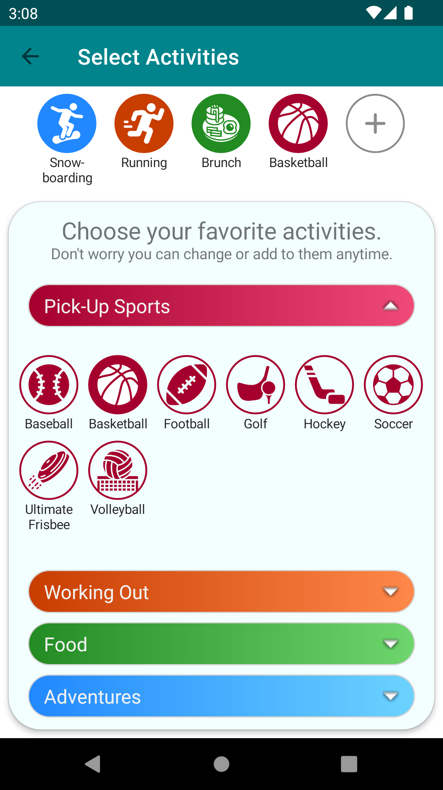
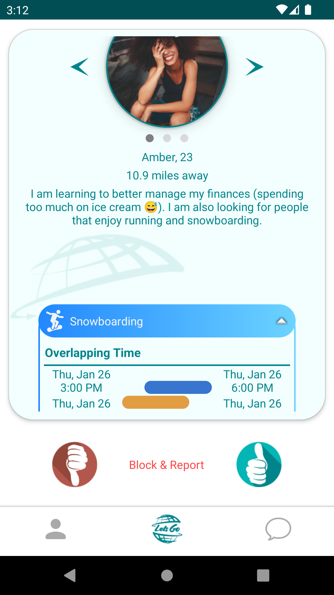
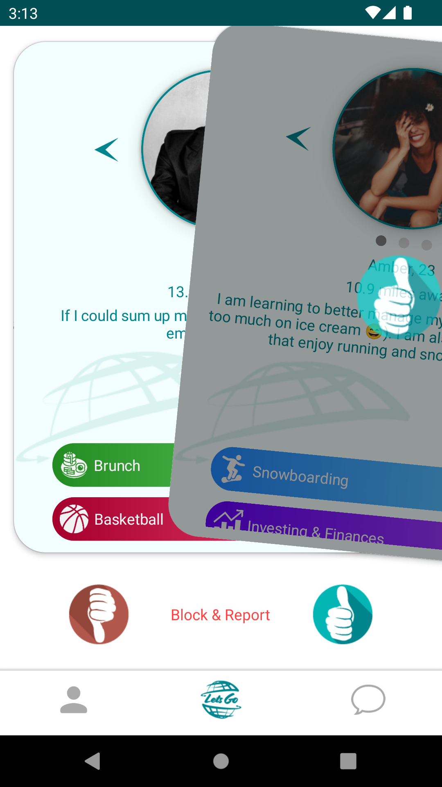
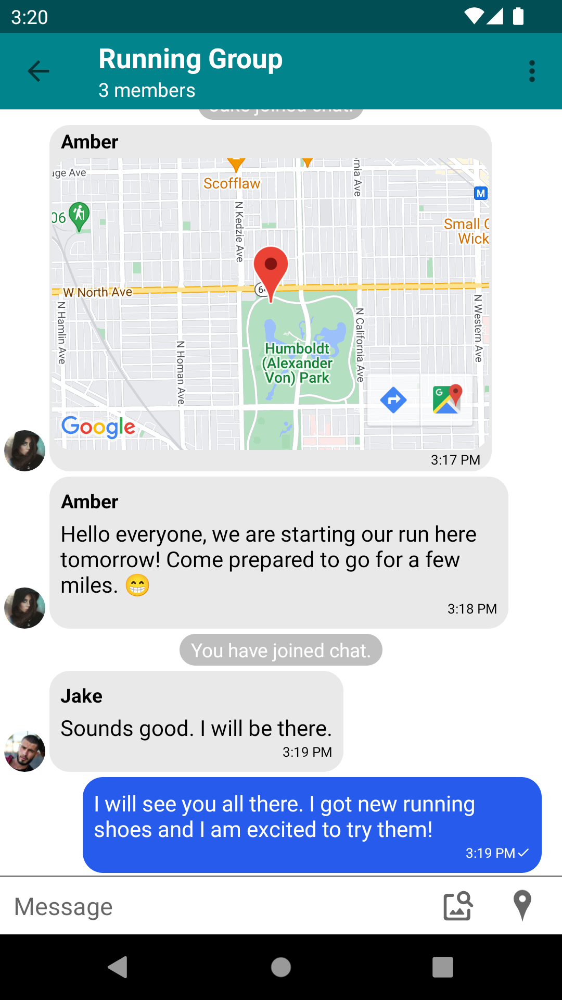

Android Studio application written in Kotlin.

The Android client that the user interacts with. Below are some examples of the GUI in different parts of the app.

      

UI/UX philosophy
GRPC in Android
Login, process, Google, phone
Tutorial
User cards
Submitting Feedback
Updating profile
Matching algorithm
Chat rooms features
Selecting activities
